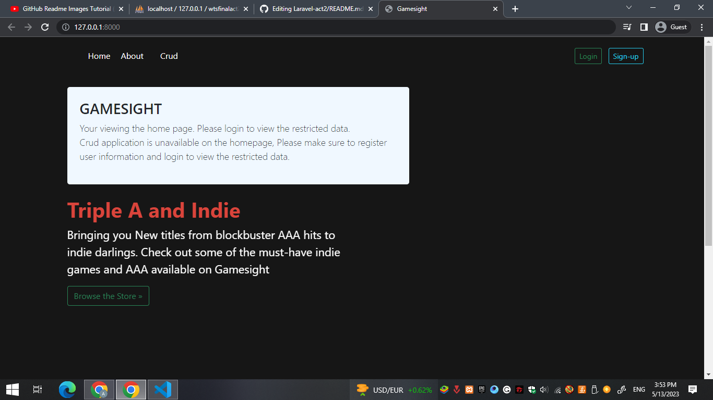
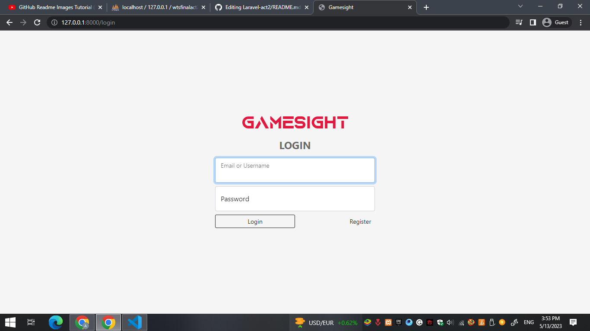
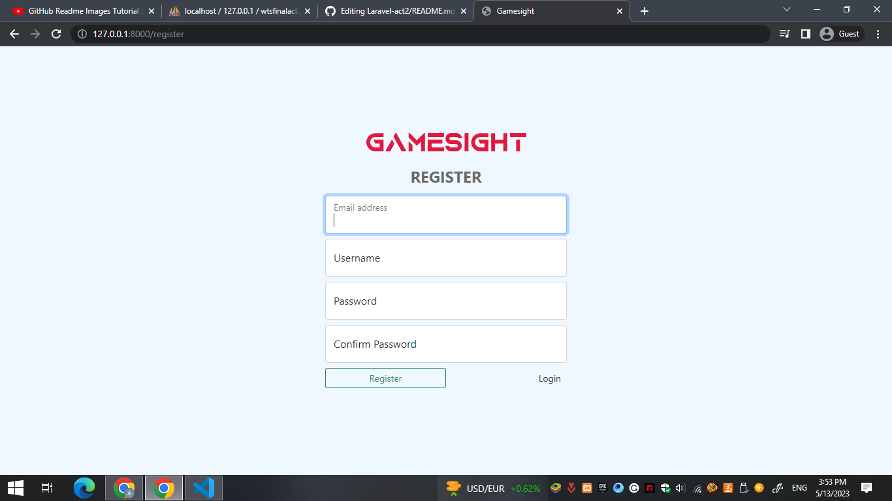
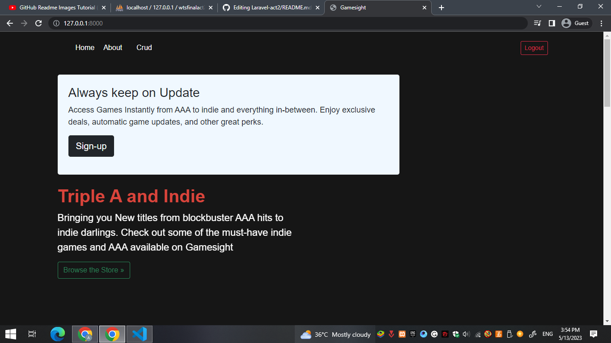
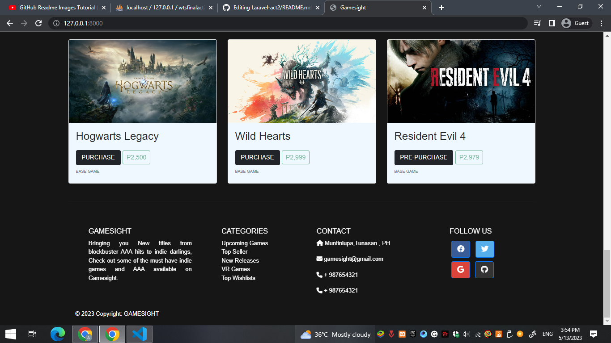
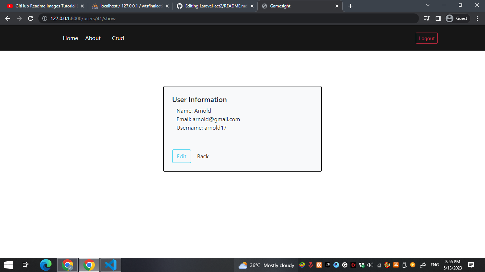
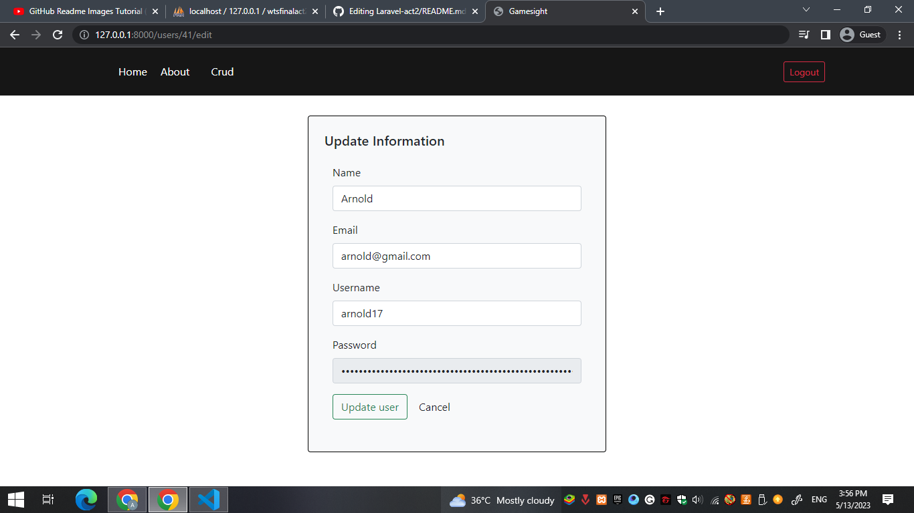
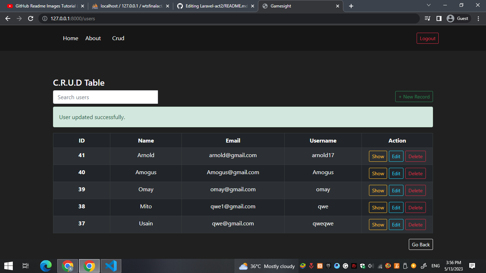
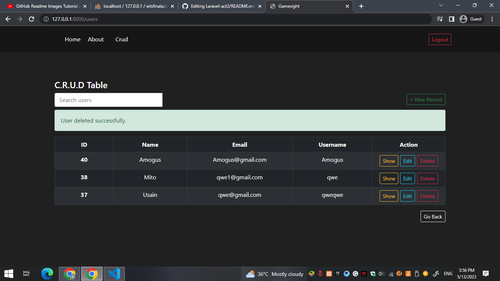

I must admit that i'm less knowledgeable about the specific steps involved in deploying a Laravel project.
As a result, i have faced difficulties in configuring the project for optimal deployment on Github.

Landing page

Log-in page

Register page

Main page with logout 

Main page

Main page

Crud application page

Crud application page

Show users information

Edit users information

Update users information

Delete users information

